# ECHELON

Operational Intelligence Platform for Real-Time Infrastructure Monitoring and Incident Assessment.

## Overview

I built ECHELON to explore how modern backend systems, computer vision, geospatial data, and AI-generated analysis could work together inside a single application.

The idea started as a simple incident reporting platform, but gradually evolved into a larger project focused on operational awareness. Users can create incidents, upload images, view nearby infrastructure, analyze possible impacts, and receive automated summaries generated from the available information.

The goal was not to build a perfect emergency management system. Instead, I wanted a project that would allow me to learn and combine several areas of software engineering that interested me, including backend development, databases, real-time communication, computer vision, mapping, and AI integration.

ECHELON is the result of that process.

The project was built using FastAPI, PostgreSQL, OpenCV, YOLOv8, WebSockets, and OpenAI-powered reporting workflows.


## Whhat the Porject Can Do

- JWT-based user authentication
- Real-time incident management
- Interactive geospatial dashboard
- Infrastructure asset monitoring
- Infrastructure dependency mapping
- Computer vision image analysis
- Fire and smoke detection
- Structural damage assessment
- Traffic activity analysis
- Composite intelligence fusion
- AI-generated operator briefs
- Real-time WebSocket updates
- Dockerized deployment


## Technology Stack

### Backend

- FastAPI
- SQLAlchemy
- PostgreSQL
- Alembic
- JWT Authentication
- WebSockets

### Computer Vision

- OpenCV
- YOLOv8
- NumPy

### AI

- OpenAI API

### Custom Analysis

- Risk scoring and analysis aggregation
- Infrastructure impact assessment
- Dependency analysis

### Frontend

- HTML
- CSS
- JavaScript
- Leaflet Maps

### Deployment

- Docker
- Render
- GitHub


## Demo Video

[Watch ECHELON Demo](https://youtu.be/dg6amVi7ups)


## Screenshots

### Operational Dashboard

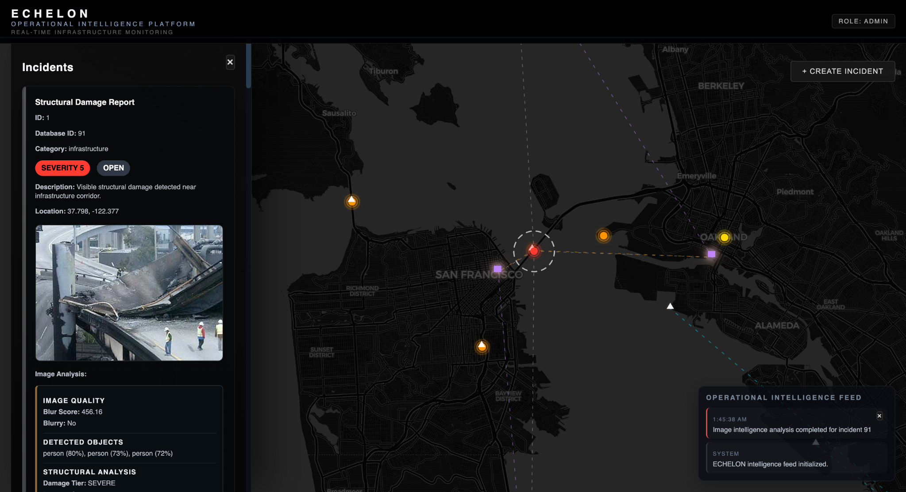

The dashboard serves as the central view of the application, bringing together incidents, infrastructure information, image analysis results, and live updates in one place.


### Incident Creation Workflow

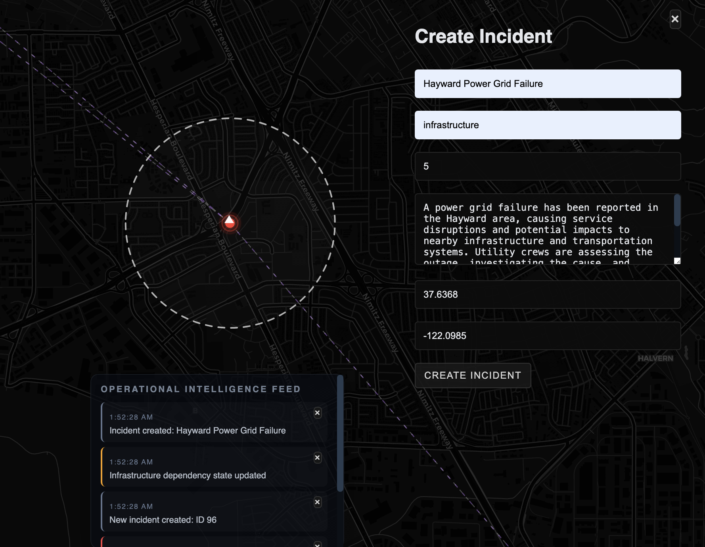

Operators can create incidents directly from the map interface by selecting a location, assigning severity levels, and providing operational context.


## Example Incident Analyses

The examples below demonstrate how Echelon combines computer vision, infrastructure analysis, and AI-generated operational summaries.

### Traffic Congestion Assessment

Heavy vehicle congestion detected near critical transportation routes.

<p align="center">
  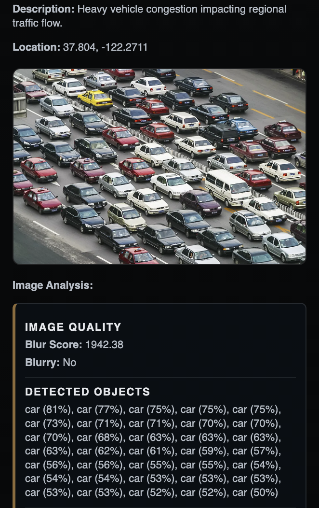
  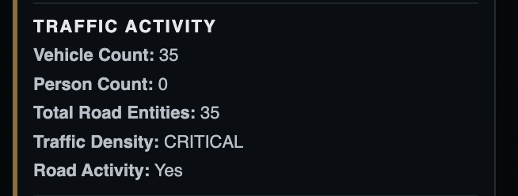
  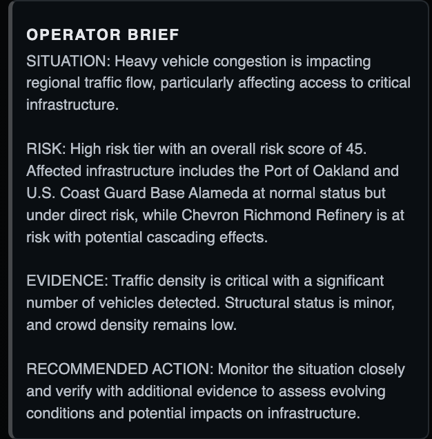
</p>

This example shows YOLO vehicle detection, traffic density analysis, risk scoring, and an AI-generated operator brief summarizing the operational impact on nearby infrastructure.

### Fire and Critical Infrastructure Incident

Power grid fire affecting regional infrastructure assets.

<p align="center">
  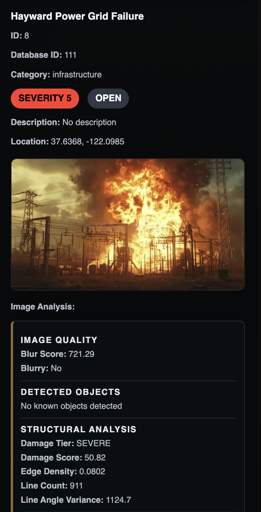
  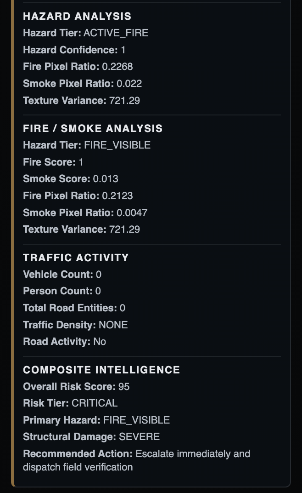
  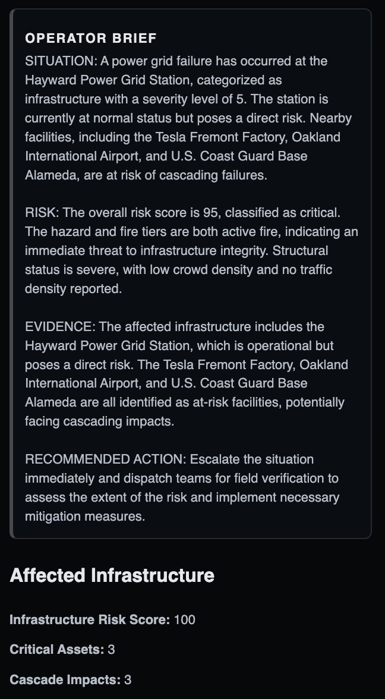
</p>

The image is processed through fire and smoke detection, structural analysis, hazard scoring, infrastructure impact assessment, and composite risk scoring. The results are then summarized into an operational briefing.

### Structural Damage Assessment

Visible structural damage detected near critical infrastructure.

<p align="center">
  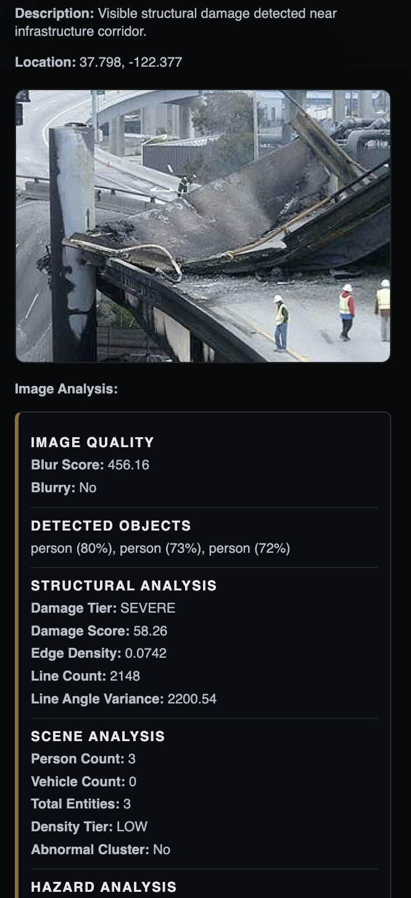
  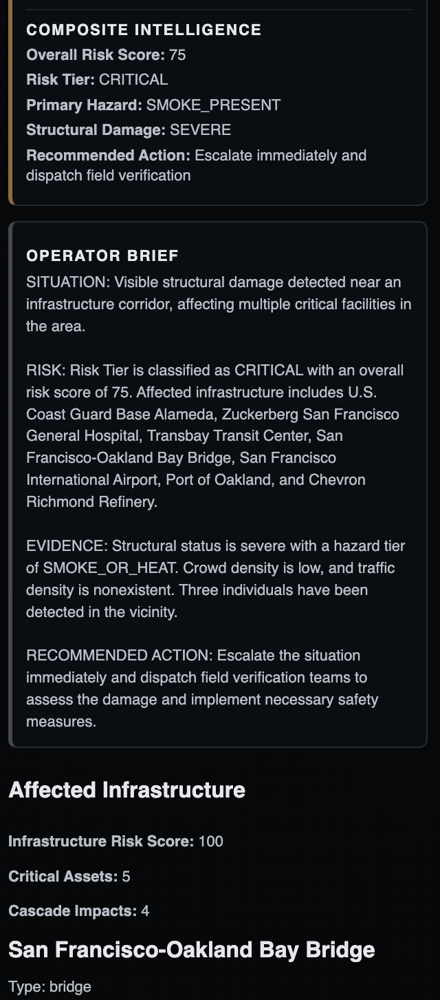
  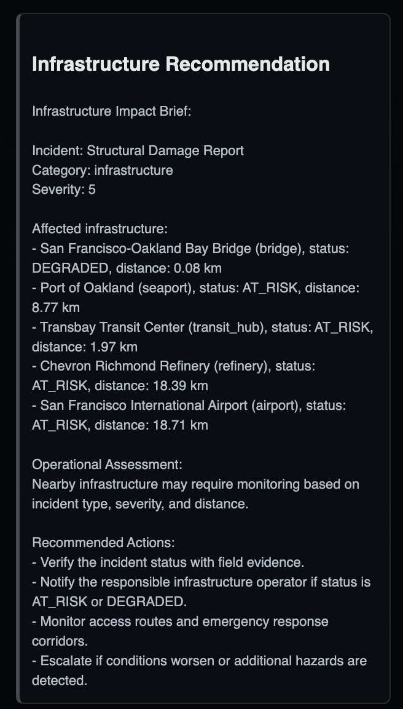
</p>

This scenario demonstrates structural damage scoring, scene assessment, infrastructure impact evaluation, and AI-assisted recommendations.

### Infrastructure Dependency Analysis

Critical assets can be linked through dependency relationships. When one asset becomes degraded, ECHELON evaluates potential cascading impacts across connected infrastructure.

<p align="center">
  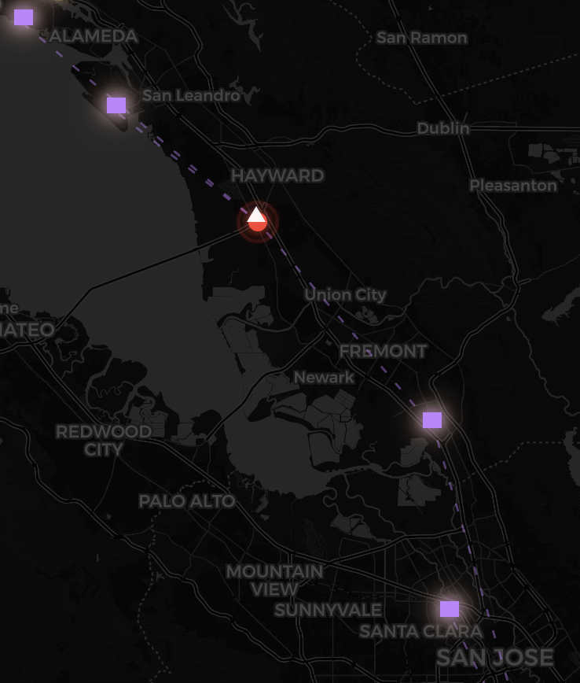
  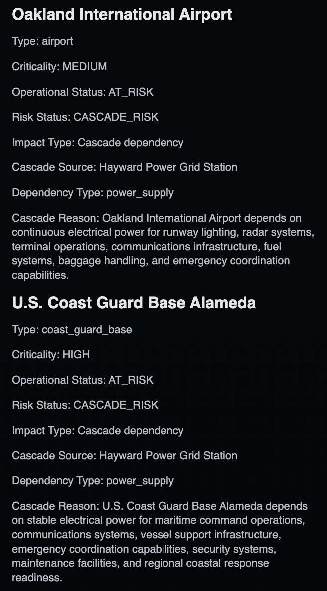
</p>

In this example, a simulated power grid failure affects multiple dependent assets. The platform identifies downstream infrastructure that may be exposed and generates impact explanations to support operational planning.

### Real-Time Operational Feed

<p align="center">
  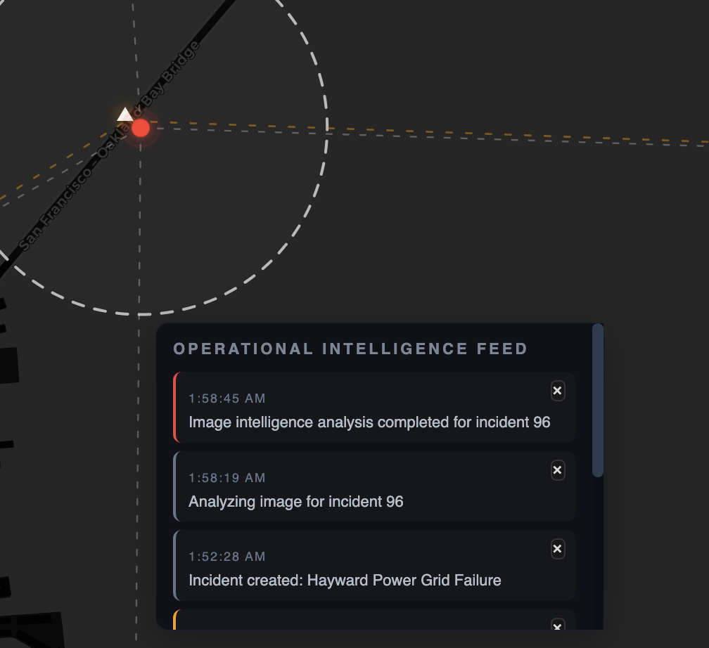
</p>

ECHELON uses WebSockets to keep connected users synchronized in real time. Incident creation, image analysis results, infrastructure updates, and intelligence reports are automatically pushed to the dashboard without requiring a page refresh.


## System Architecture

1. Operators create incidents through the dashboard.
2. Incident data is stored in PostgreSQL.
3. Uploaded images are processed using OpenCV and YOLOv8.
4. Analysis modules generate hazard and damage indicators.
5. Intelligence Fusion combines analysis outputs into a composite operational risk score.
6. AI-generated operator briefs summarize the situation.
7. Infrastructure dependency analysis evaluates potential cascading impacts.
8. WebSocket broadcasts provide real-time updates to connected clients.


## Computer Vision Modules

### Structural Analysis

Analyzes edge density, line detection, and structural irregularities to estimate infrastructure damage severity.

### Hazard Analysis

Uses color-space and texture-based techniques to identify potential fire, smoke, heat, and hazardous conditions.

### Fire & Smoke Analysis

Performs dedicated fire and smoke detection using HSV thresholding, connected-component filtering, texture analysis, and confidence scoring.

### Scene Analysis

Evaluates crowd density, vehicle activity, and abnormal clustering behavior.

### Traffic Activity Analysis

Assesses roadway activity and traffic density using detected vehicles count.

### Intelligence Fusion

Combines outputs from multiple analysis modules into a unified operational risk score and recommended action level.


## Installation


```bash
git clone https://github.com/morklv/echelon.git
cd backend
```


```bash
pip install -r requirements.txt
```

```env
DATABASE_URL=your_database_url
SECRET_KEY=your_secret_key
OPENAI_API_KEY=your_openai_key
```

```bash
uvicorn app.main:app --reload
```


## What can be done in the future:

One area I would like to continue improving is the computer vision side of the project.

The current image analysis pipeline was built as a practical way to learn OpenCV and integrate computer vision into a larger system. It provides useful signals, but it was never intended to be a production-grade detection system.

Going forward, I would like to spend more time studying computer vision and improving the accuracy of the analysis modules, reducing false positives, and exploring more advanced approaches that could bring the platform closer to professional-grade performance.


## Created by

Mark 

Built as a portfolio project focused on backend engineering, computer vision, geospatial systems, infrastructure monitoring, and operational intelligence workflows.
