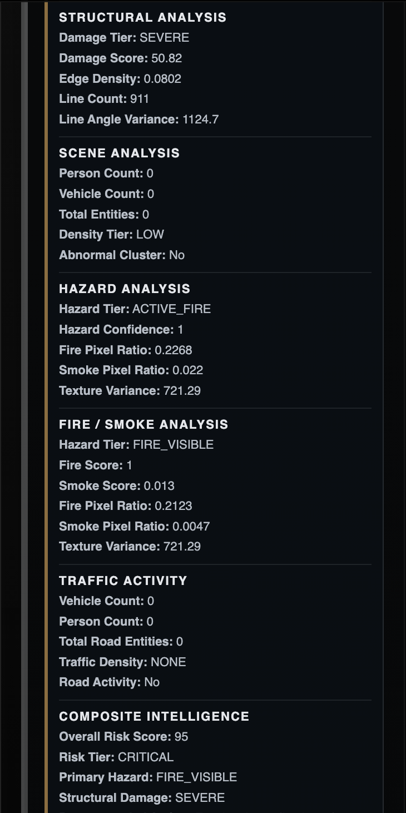
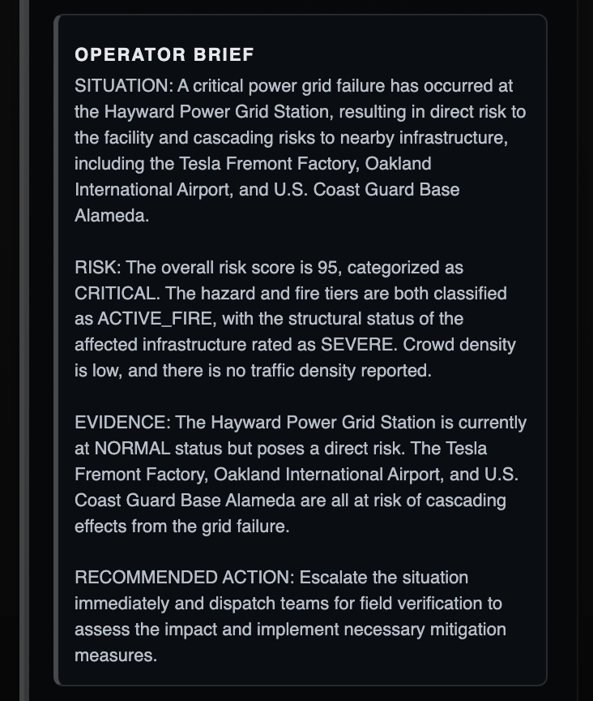
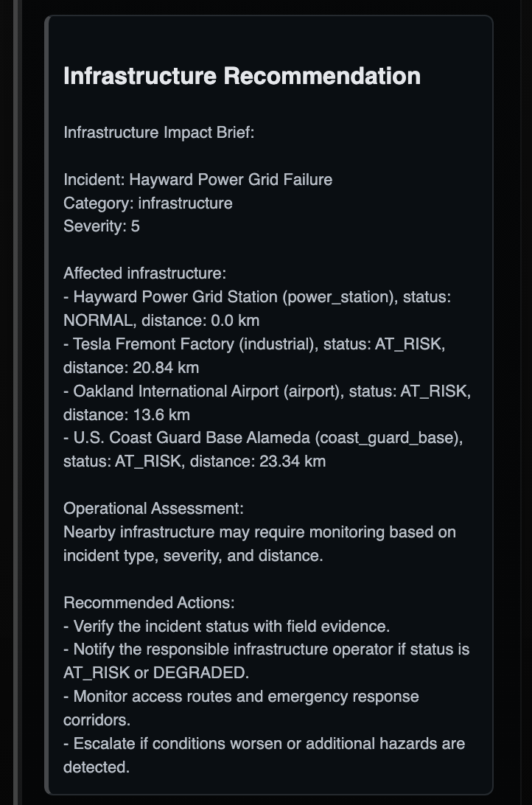

# ECHELON

Operational Intelligence Platform for Real-Time Infrastructure Monitoring and Incident Assessment.

## Overview

ECHELON is a full-stack operational intelligence platform built to support incident monitoring, infrastructure risk assessment, and operational situational awareness.

The platform combines geospatial visualization, computer vision analysis, infrastructure dependency modeling, real-time communications, and AI-generated operational summaries to help operators understand developing situations and potential downstream impacts.

The project was built using FastAPI, PostgreSQL, OpenCV, YOLOv8, WebSockets, and OpenAI-powered reporting workflows.

---

## Features

* JWT-based user authentication
* Real-time incident management
* Interactive geospatial dashboard
* Infrastructure asset monitoring
* Infrastructure dependency mapping
* Computer vision image analysis
* Fire and smoke detection
* Structural damage assessment
* Traffic activity analysis
* Composite intelligence fusion
* AI-generated operator briefs
* Real-time WebSocket updates
* Dockerized deployment

---

## Technology Stack

### Backend

* FastAPI
* SQLAlchemy
* PostgreSQL
* Alembic
* JWT Authentication
* WebSockets

### Computer Vision

* OpenCV
* YOLOv8
* NumPy

### AI

* OpenAI API
* Intelligence Fusion Engine

### Frontend

* HTML
* CSS
* JavaScript
* Leaflet Maps

### Deployment

* Docker
* Render
* GitHub

---

## Screenshots

### Operational Dashboard


The main ECHELON dashboard provides a real-time operational view of incidents, critical infrastructure assets, computer vision analysis results, and intelligence updates.

---

### Incident Creation Workflow


Operators can create incidents directly from the map interface by selecting a location, assigning severity levels, and providing operational context.

---

### Computer Vision & Intelligence Analysis



Uploaded imagery is processed through multiple analysis modules including structural damage assessment, hazard detection, fire and smoke analysis, scene assessment, traffic activity analysis, and composite intelligence fusion.

---

### AI-Generated Operator Brief



Analysis outputs are synthesized into an operational briefing that summarizes risks, evidence, affected assets, and recommended actions.

---

### Infrastructure Impact Assessment



Nearby infrastructure assets are evaluated to estimate operational impact and generate infrastructure-focused recommendations.

---

### Dependency Cascade Visualization


Infrastructure dependency relationships are used to identify potential cascading effects and downstream operational risks across connected assets.

---

## Real-Time Event Feed


ECHELON uses WebSockets to push live updates to connected clients. Events such as incident creation, infrastructure status changes, image analysis progress, and completed intelligence reports are broadcast in real time without requiring a page refresh.

---

## System Architecture

1. Operators create incidents through the dashboard.
2. Incident data is stored in PostgreSQL.
3. Uploaded images are processed using OpenCV and YOLOv8.
4. Analysis modules generate hazard and damage indicators.
5. Intelligence Fusion combines analysis outputs into a composite operational risk score.
6. AI-generated operator briefs summarize the situation.
7. Infrastructure dependency analysis evaluates potential cascading impacts.
8. WebSocket broadcasts provide real-time updates to connected clients.

---

## Computer Vision Modules

### Structural Analysis

Analyzes edge density, line detection, and structural irregularities to estimate infrastructure damage severity.

### Hazard Analysis

Uses color-space and texture-based techniques to identify potential fire, smoke, heat, and hazardous conditions.

### Fire & Smoke Analysis

Performs dedicated fire and smoke detection using HSV thresholding, connected-component filtering, texture analysis, and confidence scoring.

### Scene Analysis

Evaluates crowd density, vehicle activity, and abnormal clustering behavior.

### Traffic Activity Analysis

Assesses roadway activity and traffic density using detected vehicle and pedestrian counts.

### Intelligence Fusion

Combines outputs from multiple analysis modules into a unified operational risk score and recommended action level.

---

## Installation

Clone the repository:

```bash
git clone https://github.com/morklv/echelon.git
cd backend
```

Install dependencies:

```bash
pip install -r requirements.txt
```

Create a `.env` file:

```env
DATABASE_URL=your_database_url
SECRET_KEY=your_secret_key
OPENAI_API_KEY=your_openai_key
```

Run the application:

```bash
uvicorn app.main:app --reload
```

---

## Future Improvements

* Improved fire and smoke classification accuracy
* Expanded infrastructure dependency modeling
* Additional hazard detection modules
* Historical incident analytics
* Multi-region infrastructure datasets
* Enhanced operator workflows
* Advanced geospatial intelligence features

---

## Author

Mark 

Built as a portfolio project focused on backend engineering, computer vision, geospatial systems, infrastructure monitoring, and operational intelligence workflows.
